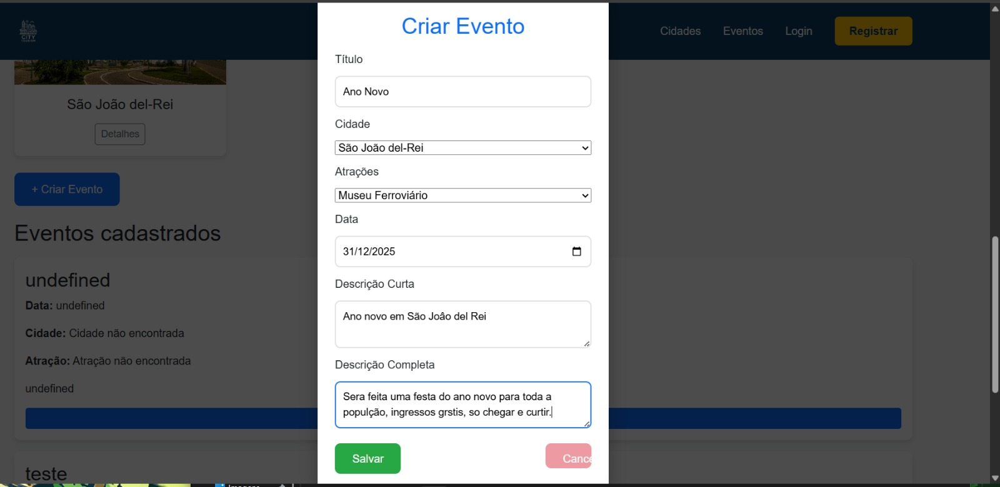
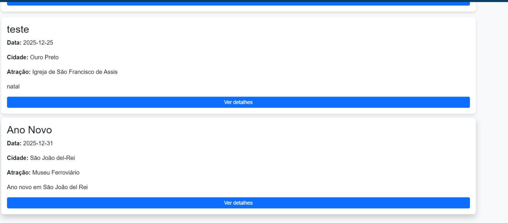
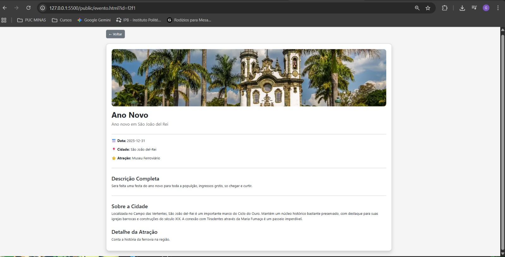

# Trabalho Prático 07 - Semanas 13 e 14

A partir dos dados cadastrados na etapa anterior, vamos trabalhar formas de apresentação que representem de forma clara e interativa as informações do seu projeto. Você poderá usar gráficos (barra, linha, pizza), mapas, calendários ou outras formas de visualização. Seu desafio é entregar uma página Web que organize, processe e exiba os dados de forma compreensível e esteticamente agradável.

Com base nos tipos de projetos escohidos, você deve propor **visualizações que estimulem a interpretação, agrupamento e exibição criativa dos dados**, trabalhando tanto a lógica quanto o design da aplicação.

Sugerimos o uso das seguintes ferramentas acessíveis: [FullCalendar](https://fullcalendar.io/), [Chart.js](https://www.chartjs.org/), [Mapbox](https://docs.mapbox.com/api/), para citar algumas.

## Informações do trabalho

- Nome: Gabriel Eduardo de Oliveira Martins
- Matricula:
- Proposta de projeto escolhida: A proposta que escolhi é criar um site para mostrar um pouco das cidades mineiras, e sugerir locais como parques, museus e teatros para que a populção possa conhecer.
- Breve descrição sobre seu projeto: A ideia do meu projeto é de criar um site onde a população mineira possa conhecer mais sobre o Estado, conhecer novas cidades, museus, teatros, parques, e possa ser avisada onde vai ver eventos. 

**Print da tela com a implementação**

Foi adicionada uma função de cadastrar evento, e ver masi detalhes sobre  o mesmo.

 
  
  

<<  COLOQUE A IMAGEM TELA 2 AQUI >>
